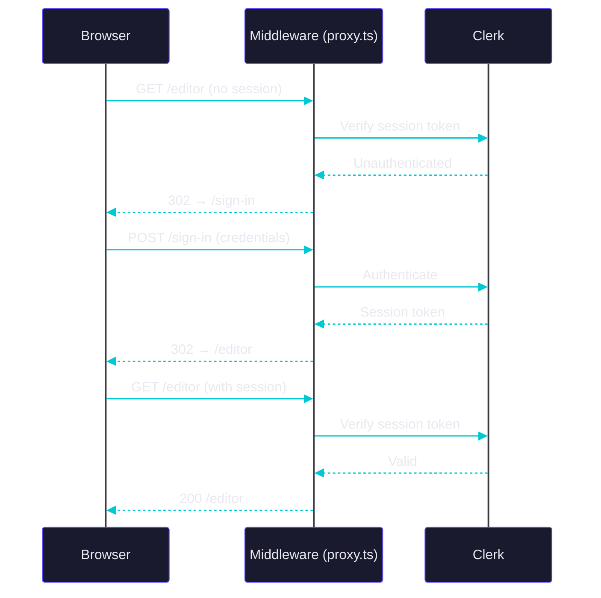

# Feature 03 — Auth

> [!abstract] Goal
> Wire Clerk authentication into Next.js — provider, route protection, auth pages, and user menu.

> [!success] Shipped
> All routes protected via `proxy.ts`. Auth pages use CSS variables. `ClerkProvider` wraps root layout. Build passes.

**References:** [[architecture-context]] · [[ui-context]] · [[code-standards]]

---

Clerk is already installed and connected. wire it into the next.js app: provider, auth pages, redirects, route protection, and user menu.

## Design

Use Clerk's `dark` theme from `@clerk/ui/themes` as the base.

Override Clerk appearance variables using the app's existing CSS variables. Do not hardcode colors.

### Sign-in and Sign-up Pages

- [x] large screens: simple two-panel layout ✅ 2026-05-06
- [x] left: compact logo, tagline, short text-only feature list ✅ 2026-05-06
- [x] right: centered Clerk form ✅ 2026-05-06
- [x] small screens: form only ✅ 2026-05-06
- [x] no gradients ✅ 2026-05-06
- [x] no oversized hero sections ✅ 2026-05-06
- [x] no feature cards ✅ 2026-05-06
- [x] no scroll heavy layouts ✅ 2026-05-06

Keep the layout minimal and professional

## Implementation

Wrap the root layout with `ClerkProvider` using Clerk's `dark` theme.

Create sign-in and sign-up pages using Clerk components.

use `proxy.ts` at the project root, not `middleware.ts`

define public routes using the existing sign-in and sign-up env vars. Protect everything else by default.

update `/`:

- [x] authenticated users redirect to `/editor` ✅ 2026-05-06
- [x] unauthenticated users redirect to `/sign-in` ✅ 2026-05-06

Add Clerk's built-in `UserButton` to the editor navbar's right section for profile settings and logout.

keep clerk's default user menu and profile flows intact. do not rebuild or heavily customize clerk internals.

use existing clerk env vars. do not rename or invent new ones.

## Dependencies

install: @clerk/ui.

## Check when done

- `proxy.ts` exists at the root
- all routes are protected except public auth paths
- auth pages use CSS variables with no hardcoded colors
- `ClerkProvider` wraps the root layout
- `npm run build` completes without errors

---

*Tracked in [[progress-tracker]]*
