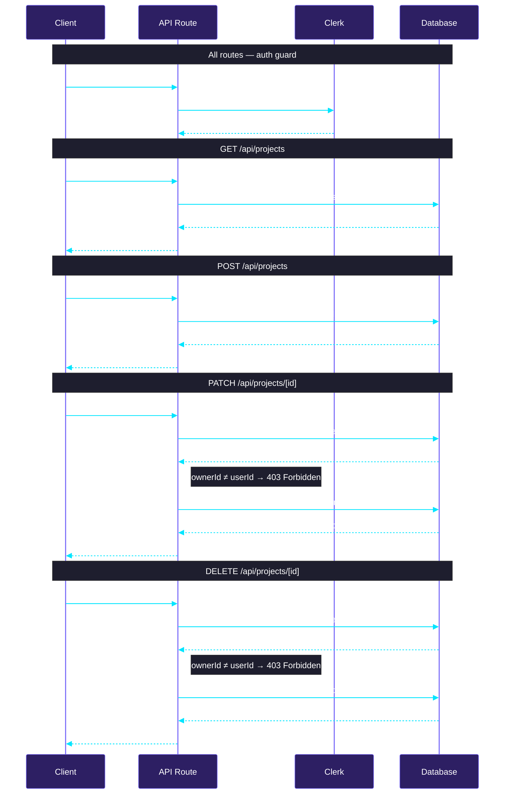

# Feature 06 — Project APIs

> [!abstract] Goal
> Build the authenticated REST endpoints for project list, create, rename, and delete.

> [!success] Shipped
> All four routes exist. Owner checks enforced. `401` and `403` handled correctly. Build passes.

**References:** [[architecture-context]] · [[code-standards]]

---

The database schema is ready. Build the backend project API routes only.

## Sequence Diagram

## Routes

Create REST endpoints for:

- [x] `GET /api/projects` , -> list current user's projects
- [x] `POST /api/projects` -> create project
- [x] `PATCH /api/projects/[projectId]` -> rename project
- [x] `DELETE /api/projects/[projectId]` -> delete project

## Rules

Use the authenticated Clerk user ID as 'ownerId'

When Creating:

- [x] default missing project name to `Untitled Project`
- [x] use the schema's existing ID strategy, do not add sequential ID's

Security:

- [x] unauthenticated requests return `401`
- [x] only the project owner can rename or delete
- [x] non-owner mutations return `403`

Keep this backend only, do not wire the UI yet.

## Check when done

- [x] routes exist for list/create/rename/delete
- [x] owner checks are enforced for rename/delete
- [x] `401` & `403` responses are handled correctly
- [x] `npm run build` passes

---

*Tracked in [[progress-tracker]]*
