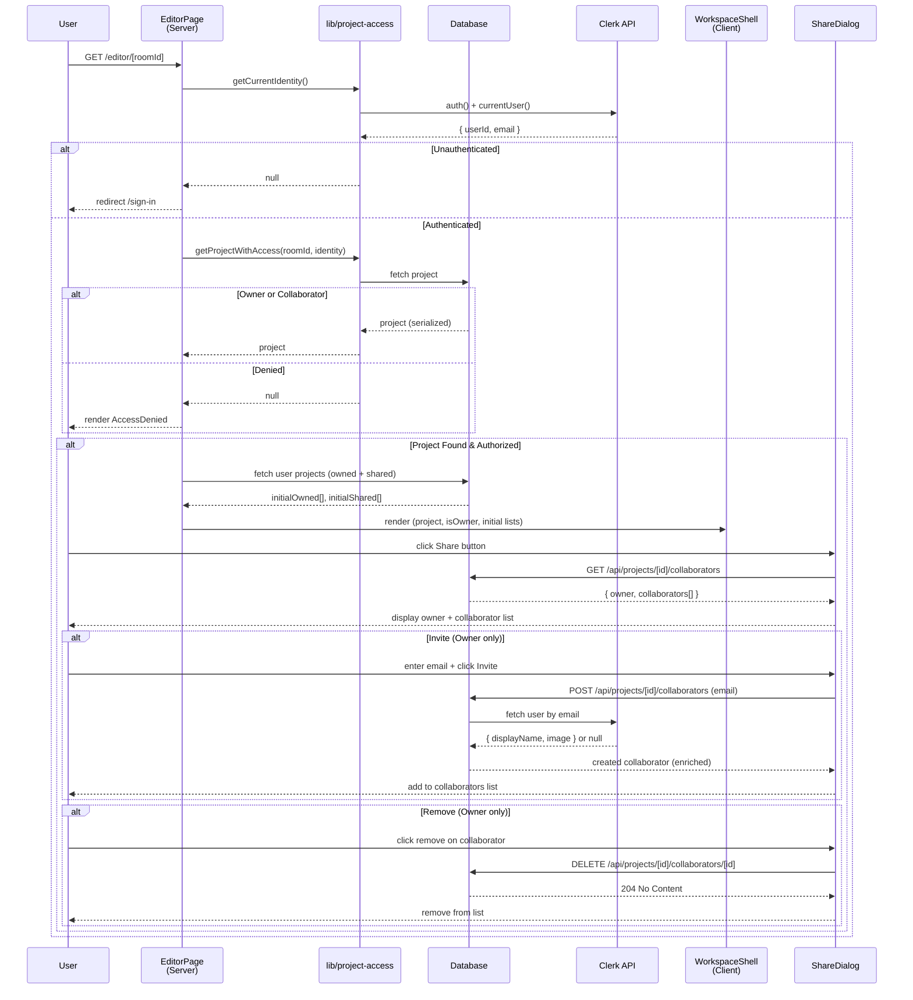

Build the `/editor/[roomId]` workspace shell with server-side access checks. No canvas logic yet.

## Access

`/editor/[roomId]` must be a server component

Before rendering:

- [x] unauthenticated users redirect to `/sign-in`
- [x] users without project access see `AccessDenied`
- [x] non-existent projects also show `AccessDenied`

Create `components/editor/access-denied.tsx` with"

- [x] centered layout
- [x] lock icon
- [x] short message
- [x] link back to `/editor`

## Access helpers

Create `lib/project-access.ts` with helpers for:

- [x] getting current Clerk identity: `userId` + primary email
- [x] checking project access by owner or collaborator

## Layout

Build a full-viewport workspace layout with:

- [x] top navbar showing the project name
- [x] navbar actions: share button and AI sidebar toggle
- [x] existing `ProjectSidebar` on the left
- [x] current room highlighted in the sidebar
- [x] central canvas placeholder with dark background and centered message
- [x] right sidebar placeholder for future AI chat

the canvas area should fill the remaining space.

## Scope

Do not add real canvas logic, Liveblocks, AI chat or sharing behavior yet.

## Check when done

- [x] `/editor/[roomId]` builds successfully
- [x] access helper exists outside the page component
- [x] `AccessDenied` is used for missing or unauthorized projects
- [x] workspace layout renders with current project context
- [x] no TS errors

