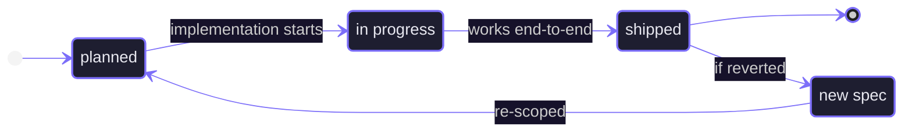

# Progress Tracker

> Update this file after each meaningful implementation change.
> Update the `TODO's` in the feature spec after it has been completed.

---

> [!info] Current Phase
> **Phase 1 — Foundation**

> [!todo] Current Goal
> Define the immediate implementation goal here.

---

## Feature Status Flow



---

## Open Tasks

```tasks
not done
path includes feature-specs
```

---

## In Progress

> [!todo] None

---

## Next Up

> [!todo] Feature 08 (TBD)
> Next planned feature unit from the feature spec queue.

---

## Completed

> [!success] Feature 07 — [[07-wire-editor-home|Wire Editor Home]]
> Server-side fetch of owned and shared projects via `lib/projects.ts`. `hooks/use-project-actions.ts` replaces mock hook — handles create (slugify + short suffix → room ID, `POST /api/projects`, navigate), rename (`PATCH`, optimistic + refresh), delete (`DELETE`, redirect if active). `POST /api/projects` accepts optional `id` to align project ID with room ID. Sidebar consumes real data. Create dialog shows room ID preview. SSL sslmode warning silenced by normalizing URL in `lib/prisma.ts`. Build passes.

> [!success] Feature 06 — [[06-project-apis|Project APIs]]
> `GET /api/projects`, `POST /api/projects`, `PATCH /api/projects/[projectId]`, `DELETE /api/projects/[projectId]`. Owner-only mutations enforced with `401`/`403`. `lib/prisma.ts` typed as `PrismaClient` to resolve Accelerate union type. Build passes on branch `feature/06-project-apis`.

> [!success] Feature 05 — [[05-prima|Database Setup]]
> Prisma 7 schema with `Project` and `ProjectCollaborator` models, migration `20260507015439_init` applied to Prisma Postgres, `lib/prisma.ts` singleton branching on `prisma+postgres://` (Accelerate) vs direct `@prisma/adapter-pg`. Build passes.

> [!success] Feature 04 — [[04-project-dialogs|Project Dialogs]]
> Editor home screen, create/rename/delete dialogs, sidebar actions with hover-reveal for owned projects, mobile backdrop scrim. Mock data only — no persistence.

> [!success] Feature 03 — [[03-auth|Auth]]
> Clerk provider, route protection via `proxy.ts`, two-panel auth layout, sign-in/sign-up pages, `UserButton` in navbar.

> [!success] Feature 02 — [[02-editor|Editor Chrome]]
> Fixed navbar with sidebar toggle, floating project sidebar with Tabs and New Project button, dialog token styling.

> [!success] Feature 01 — [[01-design-system|Design System]]
> shadcn/ui configured (New York style, Tailwind v4, CSS variables), seven components installed, `lucide-react`, `cn()` helper in `libs/utils.ts`.

---

## Open Questions

> [!question] No open questions
> Add unresolved product or implementation questions here.

---

## Session Notes

> [!warning] Tailwind v4
> CSS-first config — no `tailwind.config.js`. All shadcn variables are declared in `:root` and mapped to Tailwind utilities via `@theme inline`. No light mode.

> [!warning] tw-animate-css
> Do not import `tw-animate-css`. It breaks the entire CSS file in this Tailwind v4 + Next.js 16 + Turbopack setup. Copy required keyframes manually into `globals.css` instead.

---

_Part of [[README|Ghost AI Vault]]_
