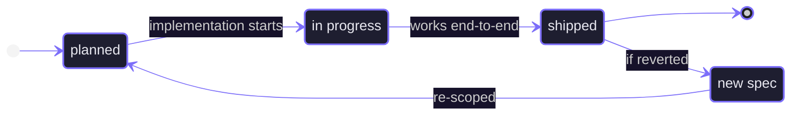

# Progress Tracker

> Update this file after each meaningful implementation change.
> Update the `TODO's` in the feature spec after it has been completed.

---

> [!info] Current Phase
> **Phase 1 — Foundation**

> [!todo] Current Goal
> Define the immediate implementation goal here.

---

## Feature Status Flow



---

## Open Tasks

```tasks
not done
path includes feature-specs
```

---

## In Progress

> [!todo] None

---

## Next Up


```meta-bind-button
id: new-feature-spec
style: primary
label: "＋ New Feature Spec"
icon: file-plus
tooltip: Creates a new spec from the standard template
action:
  type: templaterCreateNote
  templateFile: "templates/feature-spec.md"
  folderPath: "feature-specs"
  fileName: "_new-spec"
  openNote: true
```

> [!todo] Feature 15 (TBD)
> Next planned feature unit from the feature spec queue.

---

## Completed

> [!success] Feature 14 — [[14-node-editing-node-editing|Node Editing]]
> `CanvasNodeRenderer` moved to `canvas-node.tsx`. `NodeResizer` (from `@xyflow/react`) renders on selected nodes with per-shape min sizes (half of `DEFAULT_NODE_SIZES`) and `keepAspectRatio` for circles; subtle white 5×5px handles with faint border line. Four `Handle` components (top/right/bottom/left, `type="source"`, `ConnectionMode.Loose`) appear opacity-0 and transition to visible on hover via `isHovered` state. Inline label editing triggers on double-click; a `<textarea className="nodrag nopan">` renders over the label; edits debounce at 300ms to `updateNodeData` (routes through RF's `BatchProvider` → `onNodesChange` → `useLiveblocksFlow`); blur/Escape cancels the debounce and fires a single final write; `onKeyDown` stops propagation to prevent Delete/Backspace from triggering node deletion. Placeholder text shown when label is empty. Build passes.

> [!success] Feature 13 — [[13-node-shape-node-shape|Node Shape]]
> `CanvasNodeRenderer` uses CSS divs (border + borderRadius + backgroundColor) for rectangle, pill, and circle; SVG `ShapeRenderer` for diamond, hexagon, and cylinder. Selected state switches stroke from `#3a3a42` to `#00c8d4`. Node dimensions read from `NodeProps.width`/`height` with `DEFAULT_NODE_SIZES` fallback. `ShapePanel` suppresses the browser native drag ghost and renders a `DragPreview` component (fixed position, opacity 0.75, accent-cyan border) that tracks cursor via `document.addEventListener("dragover")` and cleans up on `dragend`/`drop`. A `cleanupRef` ensures stale listeners are always evicted before a new drag starts. Build passes.

> [!success] Feature 12 — [[12-shape-panel|Shape Panel]]
> `components/editor/shape-panel.tsx` renders a floating pill-shaped toolbar at the bottom-center with six draggable shape buttons (rectangle, diamond, circle, pill, cylinder, hexagon), each with inline SVG icons. Drag payload (`application/ghost-shape`) carries the shape name and default dimensions. `canvas.tsx` handles `onDragOver`/`onDrop` (passed directly as props to `<ReactFlow>`, not to a wrapper div — required so React Flow wires them onto its internal pane before its own `stopPropagation` fires), converts screen coords to flow position via `useReactFlow`, generates IDs from shape + timestamp + counter, and writes new `LiveObject` nodes to the Liveblocks storage map. `ReactFlowProvider` added in `canvas-wrapper.tsx` so `useReactFlow` is in context. `CanvasNodeRenderer` renders all shapes as a bordered rectangle with centered label. `types/canvas.ts` adds `NODE_COLORS`, `DEFAULT_NODE_COLOR`, `NodeShape`, `NODE_SHAPES`, and `DEFAULT_NODE_SIZES`. Build passes.

> [!success] Feature 11 — [[11-base-canvas|Base Canvas]]
> `components/editor/canvas-wrapper.tsx` sets up `LiveblocksProvider` + `RoomProvider` (with `cursor: null` initial presence) and a class-based error boundary + `ClientSideSuspense` loading state. `components/editor/canvas.tsx` uses `useLiveblocksFlow` (suspense mode, empty initial nodes/edges) wired into `ReactFlow` with loose connection mode, `fitView`, `MiniMap`, and dot-pattern `Background`. `types/canvas.ts` declares `CanvasNodeData` (label, color, shape), `CanvasNode`, and `CanvasEdge`. `WorkspaceShell` now renders `CanvasWrapper` in place of the placeholder. Build passes.

> [!success] Feature 10 — [[10-liveblocks-setup|Liveblocks Setup]]
> `liveblocks.config.ts` declares typed `Presence` (cursor + `isThinking`) and `UserMeta` (name, avatar, color). `lib/liveblocks.ts` exports a `globalThis`-cached `Liveblocks` node client and a deterministic `userIdToColor` helper (10-color palette, djb2 hash). `POST /api/liveblocks-auth` requires Clerk auth, verifies project membership via `getProjectWithAccess`, calls `getOrCreateRoom` with private defaults, and returns a signed access-token session with user name, avatar, and cursor color. `@liveblocks/node` installed. Build passes.

> [!success] Feature 09 — [[09-share-dialog|Share Dialog]]
> Three API routes under `/api/projects/[projectId]/collaborators` handle listing, inviting, and removing collaborators with owner-only enforcement. `ShareDialog` client component fetches collaborators on open, enriches them with Clerk display name + avatar via backend API, and renders owner (invite + remove) vs. collaborator (read-only) views. Copy-link button with `Copied!` feedback. `WorkspaceShell` receives `isOwner` from the server page and manages dialog state. Build passes.

> [!success] Feature 08 — [[08-editor-workspace-shell|Editor Workspace Shell]]
> `lib/project-access.ts` provides `getCurrentIdentity()` and `getProjectWithAccess()` for server-side auth + ownership checks. `AccessDenied` component shown for missing or unauthorized projects. `/editor/[roomId]` is a server component that redirects unauthenticated users and renders the workspace. `WorkspaceShell` client component wraps `WorkspaceNavbar` (project name, share button, AI toggle), `ProjectSidebar` (with active room highlighted), canvas placeholder, and collapsible AI sidebar placeholder. Build passes.

> [!success] Feature 07 — [[07-wire-editor-home|Wire Editor Home]]
> Server-side fetch of owned and shared projects via `lib/projects.ts`. `hooks/use-project-actions.ts` replaces mock hook — handles create (slugify + short suffix → room ID, `POST /api/projects`, navigate), rename (`PATCH`, optimistic + refresh), delete (`DELETE`, redirect if active). `POST /api/projects` accepts optional `id` to align project ID with room ID. Sidebar consumes real data. Create dialog shows room ID preview. SSL sslmode warning silenced by normalizing URL in `lib/prisma.ts`. Build passes.

> [!success] Feature 06 — [[06-project-apis|Project APIs]]
> `GET /api/projects`, `POST /api/projects`, `PATCH /api/projects/[projectId]`, `DELETE /api/projects/[projectId]`. Owner-only mutations enforced with `401`/`403`. `lib/prisma.ts` typed as `PrismaClient` to resolve Accelerate union type. Build passes on branch `feature/06-project-apis`.

> [!success] Feature 05 — [[05-prima|Database Setup]]
> Prisma 7 schema with `Project` and `ProjectCollaborator` models, migration `20260507015439_init` applied to Prisma Postgres, `lib/prisma.ts` singleton branching on `prisma+postgres://` (Accelerate) vs direct `@prisma/adapter-pg`. Build passes.

> [!success] Feature 04 — [[04-project-dialogs|Project Dialogs]]
> Editor home screen, create/rename/delete dialogs, sidebar actions with hover-reveal for owned projects, mobile backdrop scrim. Mock data only — no persistence.

> [!success] Feature 03 — [[03-auth|Auth]]
> Clerk provider, route protection via `proxy.ts`, two-panel auth layout, sign-in/sign-up pages, `UserButton` in navbar.

> [!success] Feature 02 — [[02-editor|Editor Chrome]]
> Fixed navbar with sidebar toggle, floating project sidebar with Tabs and New Project button, dialog token styling.

> [!success] Feature 01 — [[01-design-system|Design System]]
> shadcn/ui configured (New York style, Tailwind v4, CSS variables), seven components installed, `lucide-react`, `cn()` helper in `libs/utils.ts`.

---

## Open Questions

> [!question] No open questions
> Add unresolved product or implementation questions here.

---

## Session Notes

> [!warning] Tailwind v4
> CSS-first config — no `tailwind.config.js`. All shadcn variables are declared in `:root` and mapped to Tailwind utilities via `@theme inline`. No light mode.

> [!warning] tw-animate-css
> Do not import `tw-animate-css`. It breaks the entire CSS file in this Tailwind v4 + Next.js 16 + Turbopack setup. Copy required keyframes manually into `globals.css` instead.

---

_Part of [[README|Ghost AI Vault]]_
