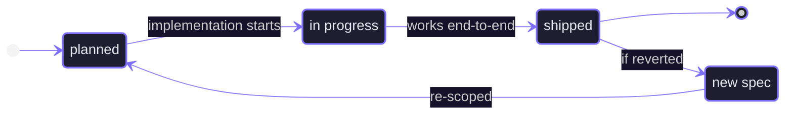

# Progress Tracker

> Update this file after each meaningful implementation change.
> Update the `TODO's` in the feature spec after it has been completed.

---

> [!info] Current Phase
> **Phase 2** — Phase 1 (Foundation) completed with spec 25

> [!todo] Current Goal
> Implement spec 26 — Canvas Autosave. Install @vercel/blob, rename Prisma field, build GET/PUT canvas routes, autosave hook, and load-on-empty-room logic.

---

## Feature Status Flow



---

## Open Tasks

```tasks
not done
path includes specs
```

---

## In Progress

> [!todo] Spec 26 — [[specs/26-canvas-autosave|Canvas Autosave]]
> Tasks 1–8 implemented (2026-06-03) on the **unmerged branch** `worktree-spec+26-canvas-autosave` — GET/PUT canvas routes, debounced autosave hook with in-flight abort, load-on-empty-room, save status indicator, navbar wiring. Remaining: human review + merge, then Task 9 verification.

---

## Next Up


```meta-bind-button
id: new-feature-spec
style: primary
label: "＋ New Feature Spec"
icon: file-plus
tooltip: Creates a new spec from the standard template
action:
  type: templaterCreateNote
  templateFile: "templates/tpl-spec.md"
  folderPath: "specs"
  fileName: "_new-spec"
  openNote: true
```

_No specs planned. Use the button above to create the next one._

---

## Completed

> [!success] Spec 25 — [[specs/25-canvas-presence|Canvas Presence — Participant Avatars and Live Cursors]]
> Liveblocks `Presence` type updated: `isThinking` renamed to `thinking`. `<PresenceAvatarGroup>` renders up to 5 collaborator avatars (photo or initials, `ring-2 ring-bg-base`, `+N` overflow chip) filtered by Clerk user ID, with a vertical divider and `<UserButton>` — mounted as `absolute right-3 top-3 z-50` inside the canvas container (not the navbar). `<LiveCursors>` reads `useOthers` cursor presence (flow coords), converts to canvas-relative pixels via `useStore(s => s.transform)`, and renders a colored SVG pointer + name badge per participant. Cursor broadcast uses `onMouseMove` / `onMouseLeave` on `<ReactFlow>` with `screenToFlowPosition`. Old `<Cursors />` from `@liveblocks/react-flow` removed. Editor home navbar and `EditorShell` untouched. Build passes.

> [!success] Spec 22 — [[specs/22-edge-enhancements|Edge Enhancements]]
> Bezier added as a fourth routing option alongside smoothstep/step/straight — wired into the settings modal, `connectionLineTypeMap`, and `CanvasEdgeRenderer`. `bendPoint` field added to `CanvasEdgeData`; `resolvePath` helper centralises path branching. Midpoint drag handle: cyan circle on selected edges, pointer events via `screenToFlowPosition`, `updateEdgeData` persists bend to Liveblocks. `DragEdgeContext` carries hover state without prop drilling. `@keyframes ghost-dash` animated dashed stroke highlights target edge on drag; `data-edgeid` + `elementsFromPoint` detection in `onDragOver`. Drop-onto-edge split logic in `onDrop`: new node spliced between source and target, label inherited by both new edges, fully undoable. Build passes.

> [!success] Spec 24 — [[specs/24-rangar-skills-package|Rangar Skills Package]]
> 13 Claude Code skills built in `rangar-skills/skills/`: `session-start`, `new-spec`, `new-issue`, `close-spec`, `ship`, `review` (parent), and six review sub-skills (`specs`, `issues`, `links`, `sync`, `drift`, `debt`), plus `init` for new-project initialization. Skills installed into `.claude/skills/rangar/`. `rangar.md` is the single source of truth read by all skills. Build passes.

> [!success] Spec 23 — [[specs/23-rangar-vault-migration|Rangar Vault Migration]]
> Vault migrated to Rangar v1.0: 22 spec files moved from `feature-specs/` to `specs/`, frontmatter normalized (`type: spec`, `feature` split into `id`+`title`, `phase` added, status vocabulary fixed). `progress-tracker.md` → `progress.md`, `current-issues.md` → `active-issues.md` with governance callout. Screenshots merged into `assets/`. Templates replaced with `tpl-spec`, `tpl-issue`, `tpl-context`. `rangar.md` living log and `README.md` Dataview hub created. `AGENTS.md` updated with Rangar identity block. Build passes.

> [!success] Spec 21 — [[specs/21-editor-folder-refactor|Editor Folder Refactor]]
> Pure structural refactor — no logic changes. `components/editor/` reorganized into four subfolders: `canvas/` (7 files), `shell/` (5 files), `panels/` (3 files), `dialogs/` (6 files). `starter-templates.ts` moved to `lib/`. `libs/utils.ts` consolidated into `lib/utils.ts`, eliminating the redundant `libs/` directory; all 10 `components/ui/` files updated. All imports updated to new paths. Build passes.

> [!success] Spec 20 — [[specs/20-user-settings|User Settings]]
> `UserSettings` Prisma model (one row per Clerk user, upserted on first fetch) with seven fields: edge routing, minimap visibility, background variant/color, snap-to-grid, default node shape/color. `lib/user-settings.ts` helper, GET/PATCH API routes at `/api/user-settings`. `UserSettingsContext` wraps `WorkspaceShell` with a saved/pending split so the canvas reflects live modal edits. `UserSettingsModal` has three sections (Canvas, Connections, Node Defaults) — all controls call `updatePending` for real-time preview; Save commits to DB, Cancel reverts. Navbar Settings icon replaces the old Map button. Canvas reads all settings from context. Initial settings fetched server-side via `Promise.all` in the workspace page — no client-side flash. Build passes.

> [!success] Feature 19 — [[specs/19-edge-reconnect|Edge Reconnect]]
> `edgesReconnectable` enabled on `<ReactFlow>` with three callbacks (`onReconnectStart`, `onReconnect`, `onReconnectEnd`) in `canvas.tsx`. A `useRef<boolean>` tracks whether the drag landed on a valid handle; missing a valid target deletes the edge via `onEdgesChange`. Reconnect builds a new edge object preserving label and data, removes the old edge, and adds the new one — both routed through `useLiveblocksFlow` so rewire and delete are in undo history. `.react-flow__edgeupdater` styled in `globals.css`: subtle dot appears on `.updating`, brightens on `:hover`. Build passes.

> [!success] Feature 18 — [[specs/18-starter-template|Starter Templates]]
> `components/editor/starter-templates.ts` defines `CanvasTemplate` type and three built-in templates (microservices, CI/CD pipeline, event-driven system) using shared canvas types and the existing node color palette. `components/editor/starter-templates-modal.tsx` renders a dialog with a scrollable card grid — each card includes a lightweight SVG diagram preview (bounds-fitted, edges as center-to-center lines, nodes drawn with shape and color), name, description, and an import button. Navbar button opens the modal; on import, existing nodes and edges are cleared, the template's nodes/edges are added via `onNodesChange`/`onEdgesChange`, and `fitView` is called. Build passes.

> [!success] Feature 17 — [[specs/17-canvas-ergonomics|Canvas Ergonomics]]
> Pill-shaped control bar at bottom-left with two groups: zoom (out / fit / in) and history (undo / redo), separated by a thin divider. Zoom actions call `instance.zoomIn/Out/fitView` with 200–300ms animation. Undo/redo use Liveblocks `useHistory()` — buttons dim when `canUndo`/`canRedo` is false. `hooks/useKeyboardShortcuts.ts` listens on `window`, skips editable fields via `isEditing()`, and handles `+`/`=` (zoom in), `-` (zoom out), `Ctrl+Z` (undo), `Ctrl+Shift+Z` / `Ctrl+Y` (redo), `Home` (fit view). Build passes.

> [!success] Feature 16 — [[specs/16-color-toolbar|Nodes Color Toolbar]]
> `textColor` field added to `CanvasNodeData`. `components/editor/node-color-toolbar.tsx` renders a floating pill toolbar (absolutely positioned above the selected node) with 8 color swatches from `NODE_COLORS`. Each swatch shows hover glow and active ring; selection calls `updateNodeData` with both `color` and `textColor`, routing through React Flow's `BatchProvider` → `onNodesChange` → `useLiveblocksFlow`. Toolbar visible only when `selected` is true. Build passes.

> [!success] Feature 15 — [[specs/15-edge-behavior|Edge Behavior]]
> `components/editor/canvas-edge.tsx` renders edges with `getSmoothStepPath` (right-angle routing), `MarkerType.ArrowClosed`, and a 16px transparent hit-area stroke for easier clicking. Edges dim at rest (`rgba(248,250,252,0.35)`) and brighten on hover/selection (`rgba(248,250,252,0.85)`). `EdgeLabelRenderer` positions an inline label at the path midpoint; double-click enters edit mode with an auto-growing input; label saves on blur/Enter/Escape and renders as a small pill badge; active unlabeled edges show a faint hint. `connectionLineType={ConnectionLineType.SmoothStep}` and matching `connectionLineStyle` added to `<ReactFlow>` so the preview matches the settled edge style. Build passes.

> [!success] Feature 14 — [[specs/14-node-editing|Node Editing]]
> `CanvasNodeRenderer` moved to `canvas-node.tsx`. `NodeResizer` (from `@xyflow/react`) renders on selected nodes with per-shape min sizes (half of `DEFAULT_NODE_SIZES`) and `keepAspectRatio` for circles; subtle white 5×5px handles with faint border line. Four `Handle` components (top/right/bottom/left, `type="source"`, `ConnectionMode.Loose`) appear opacity-0 and transition to visible on hover via `isHovered` state. Inline label editing triggers on double-click; a `<textarea className="nodrag nopan">` renders over the label; edits debounce at 300ms to `updateNodeData` (routes through RF's `BatchProvider` → `onNodesChange` → `useLiveblocksFlow`); blur/Escape cancels the debounce and fires a single final write; `onKeyDown` stops propagation to prevent Delete/Backspace from triggering node deletion. Placeholder text shown when label is empty. Build passes.

> [!success] Feature 13 — [[specs/13-node-shape|Node Shape]]
> `CanvasNodeRenderer` uses CSS divs (border + borderRadius + backgroundColor) for rectangle, pill, and circle; SVG `ShapeRenderer` for diamond, hexagon, and cylinder. Selected state switches stroke from `#3a3a42` to `#00c8d4`. Node dimensions read from `NodeProps.width`/`height` with `DEFAULT_NODE_SIZES` fallback. `ShapePanel` suppresses the browser native drag ghost and renders a `DragPreview` component (fixed position, opacity 0.75, accent-cyan border) that tracks cursor via `document.addEventListener("dragover")` and cleans up on `dragend`/`drop`. A `cleanupRef` ensures stale listeners are always evicted before a new drag starts. Build passes.

> [!success] Feature 12 — [[specs/12-shape-panel|Shape Panel]]
> `components/editor/shape-panel.tsx` renders a floating pill-shaped toolbar at the bottom-center with six draggable shape buttons (rectangle, diamond, circle, pill, cylinder, hexagon), each with inline SVG icons. Drag payload (`application/ghost-shape`) carries the shape name and default dimensions. `canvas.tsx` handles `onDragOver`/`onDrop` (passed directly as props to `<ReactFlow>`, not to a wrapper div — required so React Flow wires them onto its internal pane before its own `stopPropagation` fires), converts screen coords to flow position via `useReactFlow`, generates IDs from shape + timestamp + counter, and writes new `LiveObject` nodes to the Liveblocks storage map. `ReactFlowProvider` added in `canvas-wrapper.tsx` so `useReactFlow` is in context. `CanvasNodeRenderer` renders all shapes as a bordered rectangle with centered label. `types/canvas.ts` adds `NODE_COLORS`, `DEFAULT_NODE_COLOR`, `NodeShape`, `NODE_SHAPES`, and `DEFAULT_NODE_SIZES`. Build passes.

> [!success] Feature 11 — [[specs/11-base-canvas|Base Canvas]]
> `components/editor/canvas-wrapper.tsx` sets up `LiveblocksProvider` + `RoomProvider` (with `cursor: null` initial presence) and a class-based error boundary + `ClientSideSuspense` loading state. `components/editor/canvas.tsx` uses `useLiveblocksFlow` (suspense mode, empty initial nodes/edges) wired into `ReactFlow` with loose connection mode, `fitView`, `MiniMap`, and dot-pattern `Background`. `types/canvas.ts` declares `CanvasNodeData` (label, color, shape), `CanvasNode`, and `CanvasEdge`. `WorkspaceShell` now renders `CanvasWrapper` in place of the placeholder. Build passes.

> [!success] Feature 10 — [[specs/10-liveblocks-setup|Liveblocks Setup]]
> `liveblocks.config.ts` declares typed `Presence` (cursor + `isThinking`) and `UserMeta` (name, avatar, color). `lib/liveblocks.ts` exports a `globalThis`-cached `Liveblocks` node client and a deterministic `userIdToColor` helper (10-color palette, djb2 hash). `POST /api/liveblocks-auth` requires Clerk auth, verifies project membership via `getProjectWithAccess`, calls `getOrCreateRoom` with private defaults, and returns a signed access-token session with user name, avatar, and cursor color. `@liveblocks/node` installed. Build passes.

> [!success] Feature 09 — [[specs/09-share-dialog|Share Dialog]]
> Three API routes under `/api/projects/[projectId]/collaborators` handle listing, inviting, and removing collaborators with owner-only enforcement. `ShareDialog` client component fetches collaborators on open, enriches them with Clerk display name + avatar via backend API, and renders owner (invite + remove) vs. collaborator (read-only) views. Copy-link button with `Copied!` feedback. `WorkspaceShell` receives `isOwner` from the server page and manages dialog state. Build passes.

> [!success] Feature 08 — [[specs/08-editor-workspace-shell|Editor Workspace Shell]]
> `lib/project-access.ts` provides `getCurrentIdentity()` and `getProjectWithAccess()` for server-side auth + ownership checks. `AccessDenied` component shown for missing or unauthorized projects. `/editor/[roomId]` is a server component that redirects unauthenticated users and renders the workspace. `WorkspaceShell` client component wraps `WorkspaceNavbar` (project name, share button, AI toggle), `ProjectSidebar` (with active room highlighted), canvas placeholder, and collapsible AI sidebar placeholder. Build passes.

> [!success] Feature 07 — [[specs/07-wire-editor-home|Wire Editor Home]]
> Server-side fetch of owned and shared projects via `lib/projects.ts`. `hooks/use-project-actions.ts` replaces mock hook — handles create (slugify + short suffix → room ID, `POST /api/projects`, navigate), rename (`PATCH`, optimistic + refresh), delete (`DELETE`, redirect if active). `POST /api/projects` accepts optional `id` to align project ID with room ID. Sidebar consumes real data. Create dialog shows room ID preview. SSL sslmode warning silenced by normalizing URL in `lib/prisma.ts`. Build passes.

> [!success] Feature 06 — [[specs/06-project-apis|Project APIs]]
> `GET /api/projects`, `POST /api/projects`, `PATCH /api/projects/[projectId]`, `DELETE /api/projects/[projectId]`. Owner-only mutations enforced with `401`/`403`. `lib/prisma.ts` typed as `PrismaClient` to resolve Accelerate union type. Build passes on branch `feature/06-project-apis`.

> [!success] Feature 05 — [[specs/05-prisma|Database Setup]]
> Prisma 7 schema with `Project` and `ProjectCollaborator` models, migration `20260507015439_init` applied to Prisma Postgres, `lib/prisma.ts` singleton branching on `prisma+postgres://` (Accelerate) vs direct `@prisma/adapter-pg`. Build passes.

> [!success] Feature 04 — [[specs/04-project-dialogs|Project Dialogs]]
> Editor home screen, create/rename/delete dialogs, sidebar actions with hover-reveal for owned projects, mobile backdrop scrim. Mock data only — no persistence.

> [!success] Feature 03 — [[specs/03-auth|Auth]]
> Clerk provider, route protection via `proxy.ts`, two-panel auth layout, sign-in/sign-up pages, `UserButton` in navbar.

> [!success] Feature 02 — [[specs/02-editor|Editor Chrome]]
> Fixed navbar with sidebar toggle, floating project sidebar with Tabs and New Project button, dialog token styling.

> [!success] Feature 01 — [[specs/01-design-system|Design System]]
> shadcn/ui configured (New York style, Tailwind v4, CSS variables), seven components installed, `lucide-react`, `cn()` helper in `libs/utils.ts`.

---

## Open Questions

> [!question] No open questions
> Add unresolved product or implementation questions here.

---

## Session Notes

> [!warning] Tailwind v4
> CSS-first config — no `tailwind.config.js`. All shadcn variables are declared in `:root` and mapped to Tailwind utilities via `@theme inline`. No light mode.

> [!warning] tw-animate-css
> Do not import `tw-animate-css`. It breaks the entire CSS file in this Tailwind v4 + Next.js 16 + Turbopack setup. Copy required keyframes manually into `globals.css` instead.

---

_Part of [[README|Ghost AI Vault]]_
