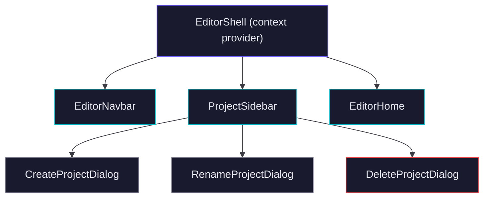

# UI Context

> [!info] Purpose
> Theme, colors, typography, canvas design, component conventions, and layout patterns for Ghost AI.

## Theme

Dark only. No light mode. The visual language is a dark technical workspace — near-black backgrounds, layered surfaces, and vivid accent colors for interactive elements.

All colors are defined as CSS custom properties in `globals.css` and mapped to Tailwind tokens via `@theme inline`. Components must use these tokens — no hardcoded hex values or raw Tailwind color classes like `zinc-*`.

| Role             | CSS Variable           | Hex / Value               |
| ---------------- | ---------------------- | ------------------------- |
| Page background  | `--bg-base`            | `#080809`                 |
| Surface          | `--bg-surface`         | `#111114`                 |
| Elevated surface | `--bg-elevated`        | `#18181c`                 |
| Subtle surface   | `--bg-subtle`          | `#1e1e23`                 |
| Default border   | `--border-default`     | `#2a2a30`                 |
| Subtle border    | `--border-subtle`      | `#3a3a42`                 |
| Primary text     | `--text-primary`       | `#f0f0f4`                 |
| Secondary text   | `--text-secondary`     | `#c0c0cc`                 |
| Muted text       | `--text-muted`         | `#808090`                 |
| Faint text       | `--text-faint`         | `#505060`                 |
| Brand accent     | `--accent-primary`     | `#00c8d4` (cyan)          |
| Brand dim        | `--accent-primary-dim` | `rgba(0, 200, 212, 0.12)` |
| AI accent        | `--accent-ai`          | `#6457f9` (indigo-purple) |
| AI text          | `--accent-ai-text`     | `#8b82ff`                 |
| Error            | `--state-error`        | `#ff4d4f`                 |
| Success          | `--state-success`      | `#34d399`                 |
| Warning          | `--state-warning`      | `#fbbf24`                 |

Tailwind utility names map to these variables. Use `bg-base`, `bg-surface`, `text-copy-primary`, `text-copy-muted`, `border-surface-border`, `text-brand`, `bg-accent-dim`, etc.

## Typography

| Role      | Font       | CSS Variable        |
| --------- | ---------- | ------------------- |
| UI text   | Geist Sans | `--font-geist-sans` |
| Code/mono | Geist Mono | `--font-geist-mono` |

Both fonts are loaded via `next/font/google` and applied as CSS variables on the `<html>` element. The base `body` uses Geist Sans with `antialiased`.

## Border Radius

Radius increases with surface depth — smaller for inner elements, larger for outer containers.

| Context           | Class         |
| ----------------- | ------------- |
| Inline / small UI | `rounded-xl`  |
| Cards / panels    | `rounded-2xl` |
| Modal / overlay   | `rounded-3xl` |

## Canvas

### Node Color Palette

8 defined color pairs. Each pair specifies a dark node fill and a vivid contrasting text color tuned for readability on the dark canvas. Defined in `types/canvas.ts` as `NODE_COLORS`.

| Node fill | Text color | Character              |
| --------- | ---------- | ---------------------- |
| `#1F1F1F` | `#EDEDED`  | Neutral dark (default) |
| `#10233D` | `#52A8FF`  | Blue                   |
| `#2E1938` | `#BF7AF0`  | Purple                 |
| `#331B00` | `#FF990A`  | Orange                 |
| `#3C1618` | `#FF6166`  | Red                    |
| `#3A1726` | `#F75F8F`  | Pink                   |
| `#0F2E18` | `#62C073`  | Green                  |
| `#062822` | `#0AC7B4`  | Teal                   |

Default node color: `#1F1F1F` with `#EDEDED` text.

### Edge Style

Smooth-step path with an arrow marker. Default edge color: `#f8fafc`. Stroke width is thin — edges are visually secondary to nodes.

### Node Shapes

6 supported shapes, defined in `types/canvas.ts` as `NODE_SHAPES`. Complex shapes (diamond, hexagon, cylinder) are rendered as inline SVGs rather than CSS borders.

- `rectangle` — default general-purpose node
- `diamond` — decision / gateway
- `circle` — event / endpoint
- `pill` — service / process
- `cylinder` — database / storage
- `hexagon` — external system / boundary

### Connection Handles

Small white circular handles, hidden by default, revealed on node hover. Appear at all four sides of a node.

### Canvas Background

React Flow `<Background>` component. Canvas sits on the base background color.

## Component Library

shadcn/ui on top of Tailwind. No custom design system. Components live in `components/ui/`. Use the `shadcn` CLI to add new components rather than writing them from scratch.

## Layout Patterns

- Editor workspace: full-viewport layout — floating sidebar overlay on the left, center canvas, slide-over AI sidebar on the right.
- Sidebars: floating overlay with dark semi-transparent background and subtle border.
- Modals and dialogs: centered overlay, `rounded-3xl`, dark background with backdrop blur.
- Navbar: top bar with dark background and bottom border.

## Icons

Lucide React. Stroke-based icons only — no filled variants. Icon sizes: `h-4 w-4` for inline, `h-5 w-5` for buttons, `h-8 w-8` for feature icons in empty states.

## Component Tree

---

*Part of [[README|Ghost AI Vault]]*
